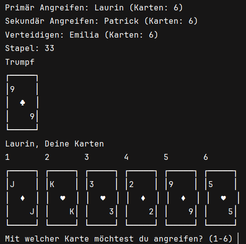
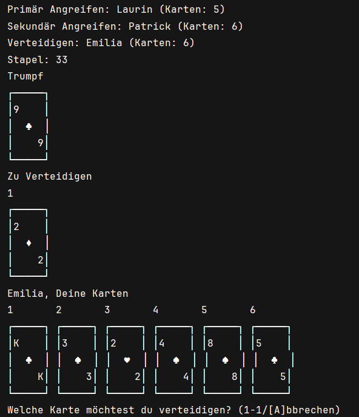
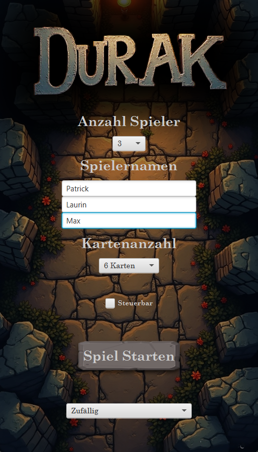
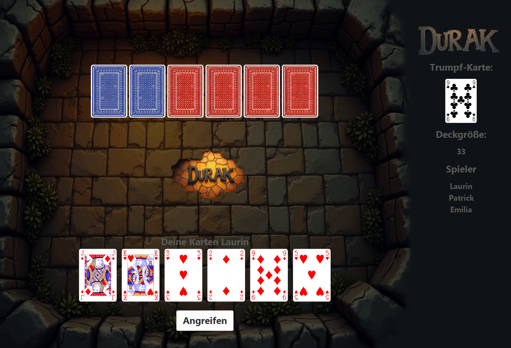
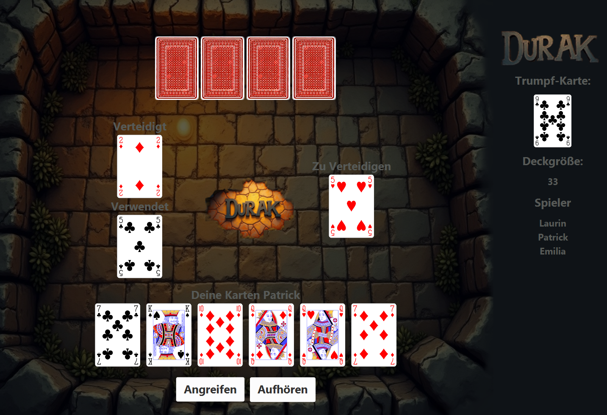

# Durak

## Project Structure

- `src/main/scala/controller`: Contains the `Controller` class which manages the game logic.
- `src/main/scala/model`: Contains the data models for the game, such as `Card`, `Player`, and `Turn`.
- `src/main/scala/util`: Contains utility classes, including the `Observer` trait for the observer pattern.
- `src/main/scala/view/gui`: Contains the GUI implementation using JavaFX.
- `src/main/scala/view/tui`: Contains the TUI implementation.
- `src/main/scala/view/tui/runner`: Contains the `Runner` classes for handling user input in the TUI.

## Project Structure

1. **Model** (`src/main/scala/model`):
    - This package contains the data models for the game, such as `Card`, `Player`, and `Turn`.
    - These classes represent the core entities and their relationships within the game.
    - Example classes: `Card`, `Player`, `Deck`, `Turn`.

2. **Controller** (`src/main/scala/controller`):
    - The `Controller` class manages the game logic and state.
    - It acts as an intermediary between the `view` and `model`, updating the view based on changes in the model and
      handling user input.
    - Key methods include `initialize`, `attack`, `defend`, `pickUp`, `undo`, `redo`, `load`, and `save`.

3. **View** (`src/main/scala/view`):
    - This package contains the user interface implementations.
    - It is divided into two sub-packages: `gui` (Graphical User Interface using JavaFX) and `tui` (Text User
      Interface).
    - The view components interact with the `Controller` to display the current state of the game and to send user
      actions to the controller.
    - Example classes: `Gui`, `Tui`.

4. **Util** (`src/main/scala/util`):
    - This package contains utility classes and traits that support the main functionality of the application.
    - It includes the `Observer` trait for implementing the observer pattern, which is used to notify views of changes
      in the model.
    - Example classes: `Observer`, `Observable`.

### How They Work Together

1. **Initialization**:
    - The game starts by initializing the `Controller`, which sets up the initial game state and creates the necessary
      model objects (e.g., players, deck).
    - The `Controller` then initializes the view (either `Gui` or `Tui`), which sets up the user interface.

2. **User Interaction**:
    - In the `Tui`, the user interacts with the game by entering commands in the console.
    - In the `Gui`, the user interacts with the game through buttons and other UI elements.
    - The view captures these interactions and sends them to the `Controller`.

3. **Game Logic**:
    - The `Controller` processes user actions and updates the model accordingly.
    - For example, when a user attacks, the `Controller` updates the game state to reflect the attack and checks if the
      move is valid.

4. **Updating the View**:
    - The `Controller` uses the observer pattern to notify the view of changes in the model.
    - The view then updates the display to reflect the current state of the game.

5. **Ending the Game**:
    - The game ends when there is only one player left with cards, and that player is declared the loser (Durak).
    - The `Controller` handles the end-of-game logic and updates the view to show the final result.

This structure ensures a clear separation of concerns, with the `model` handling data, the `controller` managing logic,
and the `view` providing the user interface. The `util` package supports these components with reusable utilities.

## Screenshots

### Text User Interface (TUI)

### Graphical User Interface (GUI)

