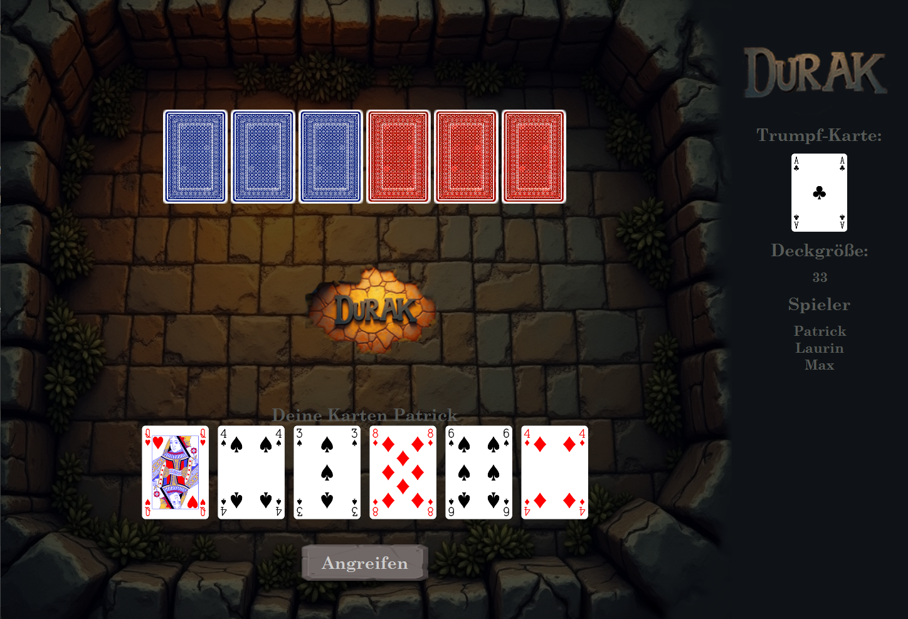
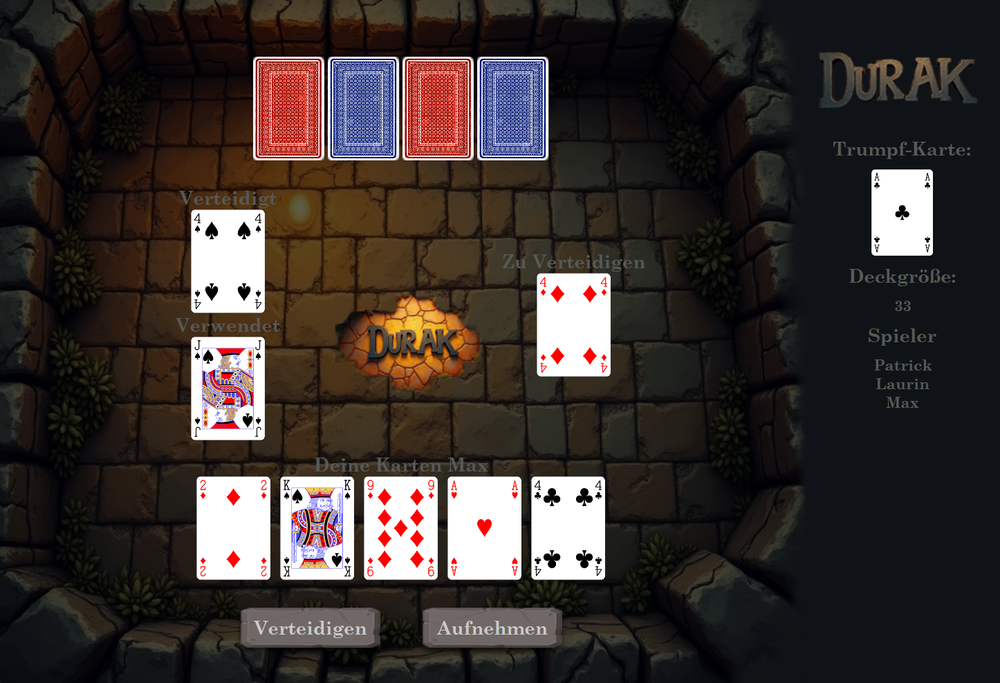

# Durak
[](https://github.com/patri9ck/durak/actions)
[](https://coveralls.io/github/patri9ck/durak?branch=)

An implementation of Durak - a popular Russian card game where players aim to avoid being the last one holding cards, using strategy and clever defense to outwit their opponents.

## Project Structure
The project consists of different components, with each having its own package.
- `src/main/scala/model`: Contains the data models for the game, such as `Status`, `Player`, and `Card`.
- `src/main/scala/controller`: Contains the `Controller` class which contains business logic.
- `src/main/scala/view/gui`: Contains the GUI implementation using JavaFX.
- `src/main/scala/view/tui`: Contains the TUI implementation.
- `src/main/scala/util`: Contains utility classes, including the `Observer` trait for the observer pattern.
- `src/main/scala/view/tui/runner`: Contains the `Runner` classes for handling user input in the TUI.

## Architecture
The project follows a Model-View-Controller Architecture
1. **Model** (`src/main/scala/model`):
    - This package contains the data models for the game, such as `Status`, `Player`, and `Card`.
    - These classes represent the core entities and their relationships within the game.
    - Example classes: `Card`, `Player`, `Deck`, `Turn`.

2. **View** (`src/main/scala/view`):
    - This package contains the user interface implementations.
    - It is divided into two sub-packages: `gui` (Graphical User Interface using JavaFX) and `tui` (Text User
      Interface).
    - The view components interact with the `Controller` to display the current state of the game and to send user
      actions to the controller.
    - Example classes: `Gui`, `Tui`.

3. **Controller** (`src/main/scala/controller`):
    - The `Controller` class contains the business logic and state.
    - It stores a `Status` instance which contains the state of the game and is updated using the controller's methods. Changes are presented to the view using the observer pattern.
    - Key methods include `initialize`, `attack`, `defend`, `pickUp`, `undo`, `redo`, `load`, and `save`.

### How They Work Together
1. **Initialization**:
    - The game starts by initializing the controller, which sets up the initial game state and creates the necessary model objects like an empty status.
    - Next, the GUI and TUI are started and the game begins.

2. **User Interaction**:
    - In the TUI, the user interacts with the game by entering commands in the console.
    - In the GUI, the user interacts with the game through buttons and other UI elements.
    - The view captures these interactions and sends them to the controller.

3. **Business Logic**:
    - The controller processes user actions and updates the state accordingly.
    - For example, when a user attacks, the controller updates the state to reflect the attack and checks if themove is valid.

4. **Updating the View**:
    - The controller uses the observer pattern to notify the view of changes in the model.
    - The view then updates the display to reflect the current state based on the state stored in the controller.

5. **Ending the Game**:
    - The game ends when there is only one player left with cards, and that player is declared the loser (Durak).
    - When a view is updated by the controller, it checks whether the game is over using methods provided by the controller.

This structure ensures a clear separation of concerns, with the models containin and handling data, the controller managing logic,and the view providing the user interface.

## Screenshots
### Text User Interface (TUI)


### Graphical User Interface (GUI)




## How to Run

### Requirements

- Java 11 or higher
- sbt (Scala Build Tool)
- ScalaFX (for GUI)

### Steps

1. Clone the repository:

    ```bash
    git clone
    ```
2. Change into the project directory:

    ```bash
    cd durak
    ```
3. Run the application using sbt:

    ```bash
    sbt "run"
    ```
   
## Docker Support

### Requirements
 
- Docker
- xMing (for GUI)

### Steps

1. Build the Docker image:

    ```bash
    docker build -t durak .
    ```
2. Run the Docker container:

    ```bash
    docker run --name durak durak-scala  
    ```
      
